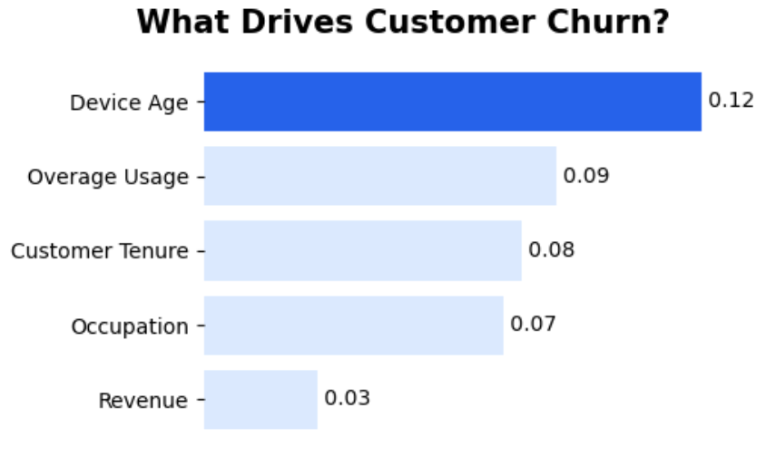

## 📌 Overview

Telecom companies often struggle with customer churn, but reacting after customers leave is too late.  
In this project, I built a predictive system to identify high-risk customers early and designed targeted retention strategies to reduce churn and increase long-term value.

---

## 🎯 Business Problem

S-Mobile aimed to shift from reactive retention to a proactive churn prevention strategy.

Key questions included:

- Which customers are most likely to churn?
- What factors drive churn behavior?
- How can targeted actions reduce churn and improve revenue?

---

## 📈 Visualization

## 🧩 Approach

### Data & Feature Engineering

- Processed ~69,000 customer records across training, testing, and real-world datasets  
- Integrated multiple feature groups:
  - Usage behavior (minutes, overage, roaming)
  - Account activity (tenure, service calls)
  - Device and network quality (handset age, dropped calls)

---

### Predictive Modeling

- Built and compared:
  - Logistic Regression  
  - XGBoost (final model)

**Final model performance (XGBoost):**
- AUC: 0.762  
- Captured nonlinear relationships and improved calibration  

To address class imbalance:
- Adjusted predicted probabilities from 50% training churn → 2% real-world churn  

---

### Key Drivers of Churn

Model interpretation revealed:

- Older devices → significantly higher churn risk  
- High overage usage → increased dissatisfaction  
- Short tenure → early-stage churn risk  
- Students → highest-risk segment  

---

## 👨🏻‍💻 Strategy Design

Based on model insights, I designed five targeted retention strategies:

- Device upgrade program  
- Overage plan optimization  
- Usage recovery outreach  
- Proactive retention calls  
- Network quality improvements  

---

## 📊 Results

| Strategy              | New Churn Rate |
|----------------------|----------------|
| Baseline             | 1.85%          |
| Device Refresh       | **1.54%**      |
| Other strategies     | 1.75% – 1.83%  |

👉 The device upgrade strategy delivered the strongest reduction in churn.

---

## 💰 Business Impact

- +SGD 123.72 customer lifetime value (CLV) per user  
- Scaled to 1M users → ~SGD 123.7M value creation  

This demonstrates that targeted retention strategies significantly outperform reactive approaches.

---

## 🧠 Key Takeaways

- Predictive models must translate into actionable strategies  
- Handling class imbalance is critical in real-world applications  
- Linking model outputs to financial metrics (CLV) makes insights decision-ready  

---

## 🛠 Tools 

Python · XGBoost · Logistic Regression · Polars · Customer Analytics · CLV Modeling