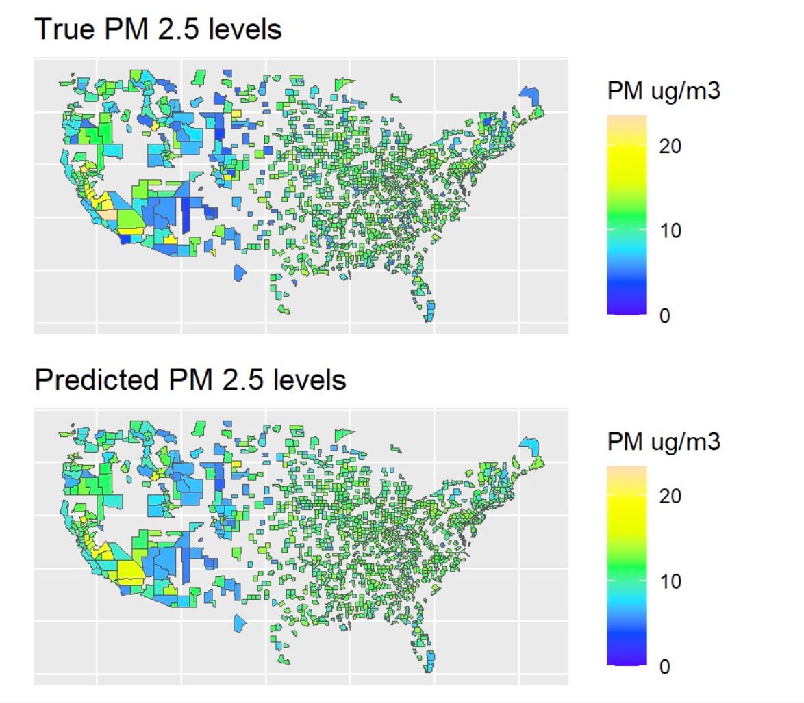

## 📌 Overview

This project applies machine learning to predict annual average air pollution (PM2.5) levels across the United States.

By combining environmental, geographic, and demographic data, the model estimates pollution in areas without monitoring stations and identifies key drivers of regional air quality differences.

## 🎯 Problem

Air pollution monitoring stations are sparsely distributed, especially outside major urban areas, making it difficult to measure pollution exposure at a granular level.

This creates gaps in environmental data that limit public health analysis and policy decisions.

The core challenge was:

- Can we predict PM2.5 levels without direct measurements?
- Which variables best explain air pollution variation?

## 🧩 Approach

The analysis integrates data from:

- EPA monitoring stations (876 locations)
- NASA satellite data
- U.S. Census data

A **Random Forest model** was developed to capture nonlinear relationships.

### Workflow

- Data cleaning & feature engineering  
- Correlation analysis  
- Train/test split (2/3 training, 1/3 testing)  
- 4-fold cross-validation  
- Hyperparameter tuning  

A **Linear Regression model** was used as a baseline.

## 📊 Results

The final Random Forest model achieved:

- RMSE: **1.72**
- R²: **0.60**

### Key findings

- Random Forest outperformed Linear Regression  
- Stronger performance in high-density regions  
- Important predictors:
  - State
  - Road density
  - Impervious surface area  

## 📈 Visualization

The model successfully captured regional pollution patterns across the U.S., with only minor deviations.

## 🧠What I Learned

- Machine learning can fill gaps in spatial data  
- Cross-validation improves model robustness  
- Handling multicollinearity is critical in high-dimensional data  
- Model performance varies across geographic contexts  

## 🛠 Tools

R · tidymodels · tidyverse · randomForest · ggplot2 · sf